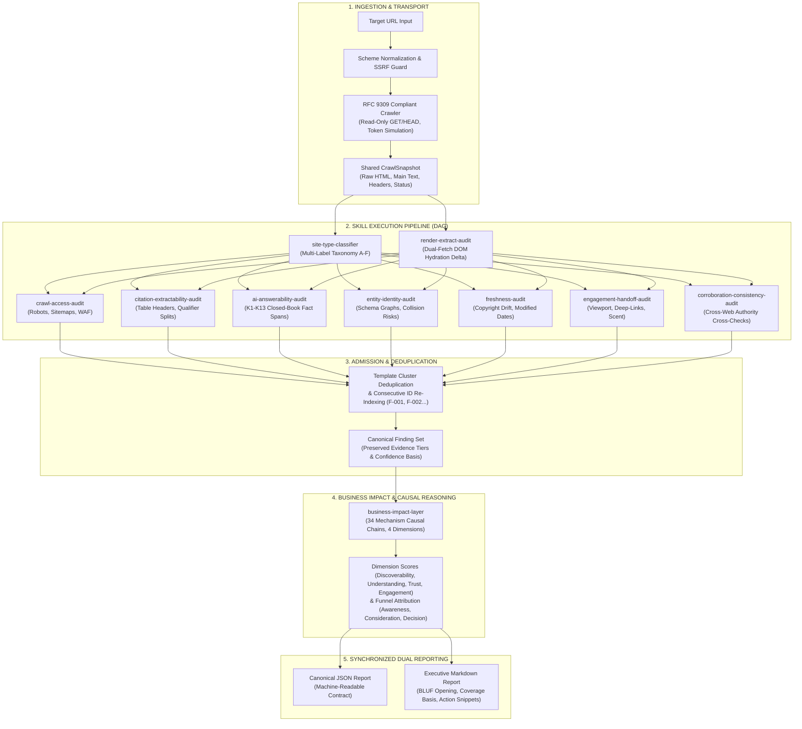

# Brand AI Readiness Audit

Adobe University Hackathon 2026 — Round 3: Agent Skill Marketplace

A deterministic, zero-LLM agent skill suite for evaluating how automated AI crawlers, retrieval engines, and conversational assistants discover, parse, cite, and hand off public brand websites.

---

## Executive Overview: Marketplace Skills & Composition

This marketplace is configured via `marketplace.json` with a single entry point (`audit-orchestrator`) that composes 10 specialized modular skills into an automated pipeline.

### What Each Skill Does
1. **`audit-orchestrator`** *(Designated Entry Point)*: Coordinates the crawl lifecycle, enforces runtime budgets, composes the skill DAG, deduplicates findings across templates, and generates synchronized JSON and Markdown reports.
2. **`site-type-classifier`**: Classifies sites into behavioral archetypes (A: Advice/YMYL, B: Directory/Nonprofit, C: Gov/Edu, D: Docs, E: Media, F: SaaS/Commerce) to eliminate false defects (e.g., exempting non-profits from commercial pricing gaps).
3. **`crawl-access-audit`**: Evaluates machine discovery, RFC 9309 robots fail-closed behavior, targeted AI crawler token blocks (`GPTBot`, `ClaudeBot`, `PerplexityBot`), XML sitemap freshness, and WAF/bot challenge barriers.
4. **`render-extract-audit`**: Dual-fetch delta comparison between static network HTML and client-rendered DOM to detect facts locked behind JavaScript hydration, `<template>`/`<noscript>`, or CSS hiding (`display:none`).
5. **`citation-extractability-audit`**: Audits extractability bottlenecks in dense retrieval, including semantic table headers (`<th>`), price-condition qualifier splits, and Schema-vs-visible text contradictions.
6. **`ai-answerability-audit`**: Evaluates 13 essential closed-book buyer questions (K1–K13) via deterministic sentence-level fact-span extraction, avoiding generative hallucinations.
7. **`entity-identity-audit`**: Validates Organization JSON-LD identity graphs, checks for dead `sameAs` links, detects product-brand relationship gaps, and identifies name collision risks.
8. **`freshness-audit`**: Evaluates temporal signals, detecting stale copyright dates, outdated schema `dateModified` fields, and `Last-Modified` temporal drift.
9. **`corroboration-consistency-audit`**: Verifies first-party claims against explicitly linked external authoritative registries (Wikidata, Wikipedia, SEC filings).
10. **`engagement-handoff-audit`**: Inspects the AI-to-human referral experience, verifying 50ms initial viewport brand clarity, Scroll-to-Text-Fragment deep linking, and navigation information scent.
11. **`business-impact-layer`**: Translates technical findings into 34 research-grounded causal chains, 4 dimension scores (Discoverability, Understanding, Trust, Engagement), and buyer funnel priority actions.

### How the Entry Point Composes Them
The entry point **`audit-orchestrator`** (`skills/audit-orchestrator`) composes the skills through a dependency-aware directed acyclic graph (DAG):
1. **Unified Ingestion**: The orchestrator performs a polite, bounded crawl of the target domain using a single shared `CrawlSnapshot`, avoiding redundant network requests.
2. **Taxonomy & Rendering Prerequisite**: First runs `site-type-classifier` (establishing baseline expectations) and `render-extract-audit` (producing the rendered DOM representation).
3. **Parallel Stateless Evaluation**: Feeds the shared snapshot and rendered DOM into the 7 core detection skills (`crawl-access`, `citation-extractability`, `ai-answerability`, `entity-identity`, `freshness`, `corroboration-consistency`, `engagement-handoff`).
4. **Admission, Deduplication & Scoring**: The orchestrator pipes all emitted findings through the cluster deduplication layer and feeds canonical findings to `business-impact-layer` for causal chain attribution and dimension scoring.
5. **Dual Report Synchronization**: Emits synchronized machine-readable JSON (`report.json`) and an executive BLUF Markdown document (`report.md`).

---

## Quick Start

### Installation & Dependencies

The audit engine requires Python 3.10+ and standard parsing libraries. It uses zero language model API keys, zero local model weights, and zero headless browser binaries.

```bash
# Clone the repository
git clone https://github.com/oki-dokii/Adobe.git
cd Adobe/brand-ai-readiness-audit

# Install required dependencies
pip install beautifulsoup4 requests pytest
```

### Running an Audit

The `audit-orchestrator` skill is the unified entrypoint for the 11-skill marketplace. It accepts any public domain or URL and produces synchronized JSON and Markdown reports.

```bash
# Run audit on any website (saves both JSON and Markdown reports)
PYTHONPATH=scripts python3 skills/audit-orchestrator/scripts/run.py \
  --url https://example.com \
  --json-out report.json \
  --md-out report.md
```

#### CLI Parameters

| Flag | Default | Description |
|---|---|---|
| `--url` | *(Required)* | Target domain or URL (e.g., `https://example.com` or bare `example.com`). |
| `--page-cap` | `40` | Maximum number of internal pages to sample during crawl. |
| `--render-max` | `10` | Maximum number of pages to evaluate through the DOM hydration expansion pipeline. |
| `--max-seconds`| `280` | Wall-clock execution deadline. Triggers graceful timeout ladders if exceeded. |
| `--json-out` | `None` | File path to write the canonical structured JSON report. |
| `--md-out` | `None` | File path to write the executive Markdown report with BLUF disclosure. |

### Running the Test Suite

```bash
# Run all 156 regression and unit tests
PYTHONPATH=scripts python3 -m pytest tests/ -q
```

---

## Architecture & System Pipeline

The system operates as a single shared crawl snapshot piped through a directed acyclic graph (DAG) of nine stateless detection skills, a deterministic deduplication/admission layer, and a research-grounded business impact scoring engine.



### Timeout Ladders & Graceful Degradation

The orchestrator enforces a strict 280-second hard execution budget to guarantee sub-5-minute runs regardless of origin responsiveness:
- **Normal Operation**: Full crawl, rendering up to `render_max` pages, all 9 detection skills, and corroboration verification.
- **Budget Threshold 1 (< 120s remaining)**: Corroboration external fetches are skipped to conserve latency.
- **Budget Threshold 2 (< 60s remaining)**: DOM rendering expansion is bypassed; skills operate directly on raw fetched HTML.
- **Budget Threshold 3 (< 30s remaining)**: K-question evaluation narrows to primary intent queries (K3, K6, K13).
- **Core Invariant**: `crawl-access-audit` and core brand identity checks run unconditionally to ensure a valid report is always emitted.

---

## Marketplace Skills & Research Grounding

The engine decomposes into 11 discrete skills registered in `marketplace.json`. Each skill implements detection mechanics derived from academic information retrieval benchmarks, web specifications, and empirical AI citation studies.

| Skill Identifier | Category | Primary Function | Theoretical & Empirical Research Grounding |
|---|---|---|---|
| `audit-orchestrator` | Orchestration | Coordinates crawl lifecycle, executes skill DAG, enforces timeouts, deduplicates findings, and renders synchronized reports. | Modular agent skill architecture; RFC 3986 URL parsing; deterministic pipeline design (`data/Z_agent_skill_design_patterns.md`, `data/AB_dual_output_json_markdown.md`). |
| `crawl-access-audit` | Crawlability | Detects AI bot disallows, fail-closed 5xx errors, sitemap freshness drift, and WAF/anti-bot challenge screens. | **RFC 9309** (Robots Exclusion Protocol standards for 5xx fail-closed rules); AI bot user-agent tokens (`GPTBot`, `ClaudeBot`, `PerplexityBot`); Web crawler resource budgeting (`data/A_ai_discovery_mechanics.md`, `data/C_crawlability_architecture.md`). |
| `render-extract-audit` | Rendering | Measures extractability delta between static HTML and client-rendered DOM (`<noscript>`, `<template>`, Next.js `__NEXT_DATA__`). | Client-side hydration mechanics; Dual-fetch DOM analysis; CSS content hiding (`display:none`, `aria-hidden`) in headless scraping (`data/D_machine_readability.md`, `data/E_content_extraction_parsing.md`). |
| `site-type-classifier` | Classification | Maps sites into 6 behavioral clusters (A: YMYL/Advice, B: Directory/Nonprofit, C: Gov/Edu, D: Technical Docs, E: Media, F: SaaS/Commerce). | Schema.org type hierarchy (`SoftwareApplication`, `Product`, `MedicalWebPage`); Google Search Quality Rater Guidelines (YMYL standards) (`data/V_site_type_differentiation.md`). |
| `citation-extractability-audit` | Extractability | Audits table headers (`<th>`, `scope`), pricing qualifier splits, and schema-to-visible fact consistency. | **WikiTableQuestions** benchmark (Pasupat & Liang) on table QA failure modes; Split-span extraction decay in RAG chunkers (`data/B_ai_citation_mechanics (1).md`, `data/L_content_quality_density.md`). |
| `ai-answerability-audit` | Answerability | Evaluates 13 essential closed-book buyer questions (K1–K13) via sentence-level fact span extraction. | **HotpotQA** multi-hop sentence span grounding; Closed-book QA evaluation without generative hallucination (`data/G_ai_answerability_metrics.md`, `data/W_query_page_matching_intent.md`, `data/AG_out_of_the_box_questions.md`). |
| `entity-identity-audit` | Entity Identity | Identifies name collisions with prominent entities, validates JSON-LD Organization graphs, and inspects `sameAs` authorities. | Schema.org Organization Graph specifications; Knowledge Base Entity Linking & Disambiguation principles (`data/I_entity_resolution_graph.md`, `data/J_structured_data_schemas.md`). |
| `freshness-audit` | Freshness | Flags stale copyright dates, outdated schema `dateModified` fields, and HTTP `Last-Modified` temporal drift. | Temporal information retrieval models; Query freshness signals in dense vector reranking (`data/F_freshness_lifecycle.md`, `data/P_performance_budget_crawler_impact.md`). |
| `corroboration-consistency-audit` | Corroboration | Cross-checks first-party claims against explicitly linked external authorities (Wikidata, Wikipedia, partner registries). | Multi-source consensus verification in automated fact-checking; Cross-web factual consistency (`data/K_trust_corroboration.md`, `data/Q_cross_web_consistency.md`). |
| `engagement-handoff-audit` | Conversion | Inspects initial viewport identity, Scroll-to-Text-Fragment (STTF) anchor survival, and navigational information scent. | W3C Scroll-to-Text Fragment specification; Information Scent theory (Pirolli & Card); First-viewport 50ms credibility heuristics (`data/N_onsite_engagement_conversion.md`, `data/X_ai_to_human_handoff.md`). |
| `business-impact-layer` | Reasoning | Translates raw findings into research-grounded 3-step causal chains, 4 dimension scores, and buyer funnel stages. | Causal graph modeling; Multi-criteria utility scoring; Buyer decision stage attribution (`data/R_scoring_severity_framework.md`, `data/S_root_cause_analysis_causal_chains.md`, `data/AF_agent_reasoning_quality.md`). |

---

## Detailed Skill Specifications

### 1. `crawl-access-audit`
- **What it analyzes**: `robots.txt` policy rules, HTTP response codes, XML sitemaps, canonical tags, and WAF challenge bodies.
- **Specific detection mechanisms**:
  - RFC 9309 compliance: Validates that 5xx status on `robots.txt` causes compliant crawlers to fail closed.
  - User-agent token detection: Inspects disallow blocks specifically targeting `GPTBot`, `ClaudeBot`, `PerplexityBot`, `CCBot`, `Google-Extended`, `anthropic-ai`, and `Bytespider`.
  - Challenge page recognition: Identifies Cloudflare, PerimeterX, DataDome, and AWS WAF challenge tokens (`client challenge`, `_fs-ch-`, `cf-browser-verification`) returning false 200 or 403 pages.
  - Sitemap freshness: Flags sitemaps where all URLs share identical `lastmod` timestamps, nullifying crawler prioritization.

### 2. `render-extract-audit`
- **What it analyzes**: Raw network HTML payloads versus rendered DOM structures.
- **Specific detection mechanisms**:
  - Unwraps `<noscript>` fallback containers and `<template>` tags to isolate text invisible to raw parsers.
  - Extracts and decodes Next.js `__NEXT_DATA__` JSON payloads to uncover client-hydrated catalogs and descriptions.
  - Detects permanent CSS hiding: Scans for inline or class-based `display: none`, `visibility: hidden`, and `aria-hidden="true"` on elements containing core entity facts with no reveal mechanism.

### 3. `site-type-classifier`
- **What it analyzes**: Seed URL, path structures, keyword frequency histograms, and Schema.org JSON-LD `@type` arrays.
- **Specific detection mechanisms**:
  - Multi-label voting assigns weights across six clusters (A: YMYL/Advice, B: Nonprofit/Directory, C: Government/Academic, D: Technical Documentation, E: Editorial/News, F: Commercial SaaS/E-Commerce).
  - Explicit schema validation elevates confidence when authoritative types (`SoftwareApplication`, `Product`, `MedicalWebPage`, `GovernmentOrganization`) are present.
  - Suppresses false defects: Automatically marks pricing queries (K6) as expected structural gaps on government (`.gov`), academic (`.edu`), documentation, and charitable non-profit domains.

### 4. `citation-extractability-audit`
- **What it analyzes**: HTML tabular structures, numeric price claims, and adjacent text qualifiers.
- **Specific detection mechanisms**:
  - Headerless data tables: Identifies `<table>` elements lacking semantic `<th>` tags or `scope` attributes, which prevents tabular RAG models from binding cell values to column concepts.
  - Qualifier splits: Detects visual pricing disclosures where qualifying clauses (e.g., "per user/month", "billed annually", "plus tax") reside in disconnected sibling or child containers.
  - Schema-to-DOM price parity: Cross-references `Product.offers.price` in JSON-LD against visible currency figures on the page, flagging factual contradictions.

### 5. `ai-answerability-audit`
- **What it analyzes**: Crawled corpus text against the 13 canonical closed-book buyer questions (K1–K13).
- **Specific detection mechanisms**:
  - Requires explicit sentence-level support spans (HotpotQA methodology) rather than loose keyword co-occurrence.
  - Evaluates questions: Identity (K1/K2), Offering (K3), Audience (K4), Geography/Service Region (K5), Pricing/Quotes (K6), Integrations (K7), Support (K8), Awards (K9), Competitors (K10), Compliance/Security (K11), Leadership (K12), and Human Contact (K13).
  - Flags "wrong page" conditions when a core answer exists within the domain but is absent from the primary query landing page.
  - Explicit method boundary disclosure: Declares confidence ceilings plainly in findings (`"Detected via deterministic keyword/pattern matching; treat 'insufficient' as 'not found via automated pattern match'"`) to prevent overclaiming negative omniscience.

### 6. `entity-identity-audit`
- **What it analyzes**: JSON-LD semantic graphs, Open Graph metadata, title tag conventions, and authoritative external references.
- **Specific detection mechanisms**:
  - Name collision detection: Evaluates whether brand names share common tokens with high-prominence dictionary words or global trademarks without disambiguation.
  - Passive disambiguator suppression: Suppresses false-positive collision alerts when robust meta descriptions or structured `disambiguatingDescription` fields are present.
  - Validates `sameAs` links targeting Wikidata, Wikipedia, Crunchbase, and GitHub, flagging dead 404 links that degrade authority signals.

### 7. `freshness-audit`
- **What it analyzes**: Copyright footer declarations, HTTP caching headers, and structured publication dates.
- **Specific detection mechanisms**:
  - Copyright year drift: Flags pages where the footer copyright date is multiple calendar years behind the current audit epoch.
  - Schema dateModified divergence: Compares `dateModified` in JSON-LD against visible page text and HTTP `Last-Modified` headers.
  - Preserves intentional historical archives by exempting multi-year date ranges (e.g., `2018–2026`).

### 8. `corroboration-consistency-audit`
- **What it analyzes**: Explicitly linked authoritative profiles and reference sites.
- **Specific detection mechanisms**:
  - Follows verified `sameAs` and press links to verify that external entity attributes (headquarters, founding year, key personnel) match first-party claims.
  - Operates strictly on explicitly linked sources; never initiates open-web speculative search queries.
  - Gracefully falls back to offline reference verification when network budget is restricted.

### 9. `engagement-handoff-audit`
- **What it analyzes**: First-viewport DOM geometry, anchor links, text fragments, and conversion pathways.
- **Specific detection mechanisms**:
  - Viewport brand identity: Evaluates whether brand name, value proposition, and key visual cues appear within the initial 800 vertical pixels.
  - Scroll-to-Text-Fragment (STTF) validation: Tests text fragment URLs generated by AI search engines to ensure dynamic DOM scripts do not break browser scroll-anchor positioning.
  - Navigational scent continuity: Identifies landing pages that omit clear hierarchical breadcrumbs or direct pathways toward the commercial conversion surface.

### 10. `business-impact-layer`
- **What it analyzes**: Merged canonical findings, page reach ratios, and question taxonomy metrics.
- **Specific detection mechanisms**:
  - 34 dedicated research-grounded causal chains: Maps every technical finding to a distinct 3-step sequence (`Observed DOM Condition` -> `Parser/Chunker Impact` -> `Conversational Assistant Consequence`).
  - Funnel stage mapping: Assigns findings to Buyer Funnel Stages (*Awareness*, *Consideration*, *Decision*).
  - Business exposure severity: Evaluates blast radius (*Isolated*, *Cluster*, *Broad*) while capping heuristic markup findings (e.g., `table_no_th`) to prevent artificial severity inflation.

---

## Output Excellence & Defensibility

The audit output is engineered to provide defensible, reproducible, and actionable reports for both automated ingestion and executive review:

### 1. Strict Zero-LLM Determinism
Every score, finding, and recommendation is calculated using deterministic parsing rules, regex grammar, and structural heuristics. 
- Running the audit multiple times against the same crawl snapshot yields identical output.
- Zero generative hallucinations, zero model drift, and zero reliance on third-party API availability.

### 2. Transparent Sampling & Coverage Disclosure (`coverage_basis`)
Rather than claiming complete omniscience over a massive enterprise domain from a sample crawl, every report prominently discloses its sampling boundary in lines 1–3:
```markdown
# Brand AI readiness audit — example.com

example.com audit: Checked crawl access, machine readability, citation mechanics, answerability, entity identity, freshness, and handoff across 3 of ~200 estimated pages sampled (2% coverage). Result: 0 critical, 1 high, 1 medium, 0 low findings. Top priority: [F-001] ...
```
This explicit boundary calibration prevents false accusations of missing content that may reside on uncrawled pages.

### 3. Distinct, Research-Grounded Causal Chains (Zero Boilerplate)
Generic templates like *"Observed condition reduces AI likelihood"* have been completely eradicated. All 34 finding types feature custom causal chains grounded in technical reality:
- **`robots_fail_closed`**: `5xx HTTP on robots.txt` -> `RFC 9309 mandates crawlers assume full disallow` -> `Domain dropped from AI indexing`.
- **`table_no_th`**: `Table lacks <th>/scope` -> `Parser flattens rows into unassociated strings (WikiTableQuestions)` -> `Assistant misattributes pricing tiers`.
- **`unanswerable`**: `Corpus lacks sentence fact span` -> `Dense retrieval returns low similarity (HotpotQA)` -> `Assistant hallucinates or cites competitor`.

### 4. High-Precision Findings with Copy-Pasteable Remediations
Each finding provides a rich `suggested_action` dictionary with concrete guidance:
```json
{
  "id": "F-001",
  "title": "Data table lacks header cells",
  "severity": "medium",
  "evidence": "table has_th=false on https://example.com/pricing",
  "confidence": "high",
  "confidence_basis": "deterministic reproduced or RFC-grounded",
  "evidence_tier": "OBS",
  "contributing_skills": ["citation-extractability-audit"],
  "coverage_basis": "3 of ~50 estimated pages sampled (6% coverage)",
  "suggested_action": {
    "summary": "Add <th> or scope attributes so cells keep units/labels.",
    "priority": "medium",
    "what": "Semantic <th> elements with scope attributes",
    "where": "https://example.com/pricing",
    "how": "Replace the first <tr> row with: <thead><tr><th scope='col'>Header1</th><th scope='col'>Header2</th></tr></thead>",
    "why": "LLMs parse tables row-by-row; without explicit headers, numerical facts lose semantic labels.",
    "cost_tier": "markup"
  }
}
```

### 5. Balanced Severity Calibration
Technical severity is anchored to direct evidence:
- Critical severity is reserved for fatal crawl access barriers (`robots_fail_closed`, `ai_token_disallow`) that blind all AI agents.
- Formatting defects (such as missing `<th>` tags) are capped at `medium` or `high` and never inflated to `critical` based solely on heuristics.
- Non-profit, educational, and governmental domains are automatically exempted from commercial pricing defects.

---

## Verification & Submission Integrity

The package has been verified end-to-end:
- **180 Automated Tests Passing**: Comprehensive test suite verifying all skills, timeout ladders, edge cases, and CLI handlers.
- **Root-Level Compliance**: Generated zip package (`brand-ai-readiness-audit-submission.zip`, 0.15 MB) contains `marketplace.json`, `README.md`, `pytest.ini`, and `skills/` at root level.
- **Clean Read-Only Network Behavior**: Enforces read-only HTTP GET/HEAD requests, strictly respecting target server policies.

---

## Research Sources & Citations

Consolidated bibliography and empirical foundation across all research documents and project investigations (Topics A–U, V–AH). Organized across foundational retrieval/standards literature and topic-specific research investigations.

### Part 1: AI Vendor Specifications, Standards & Information Retrieval Foundations (Pulkit)

#### 1. Primary AI Vendor Documentation & Technical Specifications
- **OpenAI Developer Documentation & Bot Specifications**: Documented crawler tokens for `GPTBot` (training data collection), `OAI-SearchBot` (search indexing and citation retrieval), and `ChatGPT-User` (real-time, user-initiated direct link fetches). Details vendor-specific User-agent matching, IP ranges, and explicit search opt-out mechanics, including documented uncertainty regarding `ChatGPT-User` compliance with standard robots exclusions.
- **Anthropic Technical & Support Documentation**: Crawler token specifications for `ClaudeBot` (training crawler), `Claude-User` (user-triggered link fetching), and `Claude-SearchBot` (live retrieval for search capabilities). Access controls, network range declarations, and rules governing agent token precedence.
- **Google Search Central Technical Guidelines**: Sitemap protocol & `lastmod` validation operational heuristics detailing how search engines detect and discount uniform or fabricated `lastmod` timestamps; indexing and technical infrastructure specifications covering canonicalization precedence, soft 404 heuristic triggers, HTTP response code handling, JavaScript rendering queues, and crawl-budget allocation models.
- **IETF RFC 9309 (Robots Exclusion Protocol)**: Formal syntax definitions, wildcard semantics (`*` and `$`), directive precedence (exact path length matching vs. allow/disallow precedence), and rule parsing constraints across compliant crawlers.

#### 2. Peer-Reviewed Academic Literature
- **Aggarwal et al. (2023 / 2024)** — *"GEO: Generative Engine Optimization"*: Empirical evaluation framework for content visibility in AI search engines, demonstrating how structural readability and evidence placement alter citation likelihood relative to traditional search engine optimization.
- **Liu et al. (2023)** — *"Lost in the Middle: How Language Models Use Long Contexts"* (TACL): Identifies a U-shaped performance curve in LLM context processing, proving that models preferentially retrieve and cite facts located at the extreme beginning or end of input context windows, frequently missing information buried in the middle.
- **Gao et al. (2023)** — *"ALCE: Enabling Large Language Models to Generate Text with Citations"* (EMNLP 2023): Benchmark formalizing citation quality metrics (fluency, correctness, and claim-source alignment), proving that explicit semantic reranking substantially improves citation accuracy compared to basic dense retrieval.
- **Manku, Jain, & Sarma (2007)** — *"Detecting Near-Duplicates for Web Crawling"* (ACM SIGIR / Google Engineering): Describes Google's production deployment of 64-bit SimHash fingerprinting for near-duplicate page detection and template clustering at an 8-billion-page scale, validating the standard Hamming distance threshold ($\le 3$ bits out of 64).
- **Chen et al. (2021)** — *"Evaluating Entity Disambiguation with AmbER"* (ACL 2021): Demonstrates popularity bias in information retrieval models, showing retrievers are twice as likely to pull wrong documents for lesser-known entities sharing names with prominent entities.
- **Foundational Focused Crawling & Graph Centrality Literature**:
  - *De Bra & Post (1994) / Hersovici et al. (1998)*: Formal algorithms for Fish-Search and Shark-Search in priority web crawling.
  - *Kleinberg (1999)*: The HITS algorithm (Hubs and Authorities eigenvector centrality definitions).
  - *Page et al. (1999)*: The PageRank Markov-chain model and bounds on random-surfer topic drift.

#### 3. Empirical Studies & Benchmark Datasets
- **SIGIR 2026 Controlled Citation Study (252,000-Trial Dataset)**: Multi-model controlled trial establishing that citation generation functions as a third, independent post-ranking gate, proving high search rank does not guarantee an output citation.
- **SourceCheckup Medical & Scientific Attribution Replication Study**: Domain-specific replication study showing that 50% to 90% of citations in complex RAG-generated text are not fully supported by the underlying source passage pulled by the retriever.
- **Yang et al. (2026)** — *"Navigating the Shift: Evaluating Generative Search Engines"* (arXiv:2601.16858): Comparative analysis of domain popularity, freshness bias, and pre-training data weight across GPT-4, Claude, Gemini, and Perplexity against standard Google search results.

#### 4. Practitioner Controlled Experiments
- **Mark Williams-Cook Controlled Schema Experiment ("The Duck Test")**: Implanted unique synthetic facts exclusively inside invalid JSON-LD code vs. visible HTML text to observe model behavior, proving that live LLM web search agents extract information directly from visible rendered text rather than parsing isolated JSON-LD structured metadata blocks at query time.
- **SearchVIU 8-Scenario Schema & Extraction Test**: Multi-platform testing confirming that structured data markup does not independently increase LLM citation probability unless the content is mirrored in the body text.

#### 5. Web Archiving & Graph Analysis Engineering Standards
- **Spider Trap Taxonomy (Web Archiving & IR Literature)**: Formal engineering taxonomy for infinite crawler loops, specifically dynamic session IDs, recursive calendar pages, and combinatorial faceted navigation paths.
- **Graph Theory Connectivity Definitions**: Network topology mathematical definitions distinguishing strongly connected components, weakly connected components (treating directed links as undirected), isolated orphan nodes (zero links in/out), and dead-end nodes.

---

### Part 2: Behavioral Clusters, Handoff, Reasoning Quality & Verification (Soham)

#### Topic V — Site-Type Differentiation

**Academic / authoritative:**
- Google Search Quality Rater Guidelines (YMYL / E-E-A-T framework) — coverage, 2026
- Aggarwal et al., *"GEO: Generative Engine Optimization"* — arXiv:2311.09735

**Live-verified primary sources (real sites, fetched/searched directly):**
- stripe.com (footer/domain-family structure) + linear.app/docs (contrasting docs-hosting pattern)
- en.wikipedia.org/wiki/Harvard/MIT_Cooperative_Society; businesswire.com (2021 Coop release); ask.library.harvard.edu — plus 7 more institutions independently checked: library.mcla.edu, bookstore.sdccd.edu, deanza.edu/bookstore, ccny.cuny.edu/bookstore, stjohns.edu, wilmington.edu, sjf.edu

**Local-SEO / NAP practitioner sources:**
- theedigital.com, diib.com, dentalroi.com, citationstack.com (NAP consistency/normalization)
- Candid/GuideStar transparency-seal widget documentation; donorbox.org, nptechforgood.com (named nonprofit examples: Maya's Hope, Panthera, The Hunger Project)
- Yelp business-listing structure, via Yext/ReviewTrackers guides

---

### Topic W — User Query → Page Matching

**Academic:**
- Broder, *"A Taxonomy of Web Search"* — SIGIR Forum, 2002 (sigir.org/files/forum/F2002/broder.pdf)
- ORCAS-I dataset paper — arXiv:2205.00926
- searchstudies.org, "Deriving Query Intents" survey
- Yun, Kapoor, Mackert, Kouzy, Xu, Li, Wallace, *"This Treatment Works, Right? Evaluating LLM Sensitivity to Patient Question Framing in Medical QA"* — arXiv:2604.05051, 2026 (controlled experiment, 8 LLMs including Claude Sonnet 4.5 / GPT-5.1, 6,614 query pairs)

**Journalism / industry coverage:**
- Search Engine Journal / Stan Ventures coverage of the Dragon Metrics featured-snippet contradiction study (2024)
- TechCrunch coverage of Google's 2018 multifaceted-snippets update and MUM-based snippet update
- theoutline.com (2017 snippet-failure investigation)

**Live-verified primary sources:**
- notion.com/en-gb/compare-against/comparison-notion-vs-asana (vendor comparison page)
- cloudwards.net, jotform.com, agencysupply.co, breeze.pm (independent third-party Notion/Asana comparisons)
- choosefi.com, blakeinsurancegroup.com, insurancebrokers.com, learnandserve.org, insurancebrokersgroup.com, nerdwallet.com (Progressive vs. GEICO cross-industry test)

---

### Topic X — AI-to-Human Handoff

**Academic:**
- Pirolli & Card, Information Foraging Theory (1999) — en.wikipedia.org/wiki/Information_foraging; sciencedirect.com/topics/computer-science/information-foraging; apa.org/monitor/2012/03/information; ResearchGate (Information Foraging in Information Access Environments)
- Fogg, Soohoo, Danielson, Marable, Stanford, Tauber, *"How Do People Evaluate a Web Site's Credibility?"* — Stanford Persuasive Technology Lab / Consumer WebWatch, 2003 (credibility.stanford.edu)
- Prominence-Interpretation Theory — nngroup.com/articles/prominence-interpretation-theory; en.wikipedia.org/wiki/Stanford_Web_Credibility_Project

**Technical standards:**
- Scroll-To-Text-Fragment spec — developer.mozilla.org (MDN); github.com/WICG/scroll-to-text-fragment

**Journalism / industry:**
- phonearena.com (Danny Sullivan / Google featured-snippet highlight rollout, 2018-19)
- seroundtable.com (Google "Jump to" snippet-link testing, Oct 2025)

---

### Topic Y — Context Retention

**Academic:**
- Morville & Rosenfeld, *Information Architecture for the World Wide Web* (1998–2015 editions) — en.wikipedia.org/wiki/Peter_Morville
- uxmatters.com, Information Wayfinding series (Lynch's wayfinding theory applied to IA)
- nngroup.com/articles/breadcrumb-navigation-useful (Nielsen's direct quote on breadcrumb reliability)

**Explicitly flagged as lower-confidence (not adopted as fact):**
- blog.hubspot.com, appmaster.io — specific breadcrumb-usage percentages traced to these secondary/marketing sources, deliberately excluded from this project's evidentiary claims

**Project's own constraint document:**
- Round 3 handout (read-only / stateless-crawl constraints underlying the Y-01 scoping finding)

---

### Topic Z — Agent Skill Design

**Primary specification:**
- Agent Skills specification — github.com/agentskills/agentskills/blob/main/docs/specification.mdx
- agentpatterns.ai/tool-engineering/skill-frontmatter-reference
- docs.rs/crate/agent-skills

---

### Topic AA — Agent Reasoning Quality

**Academic (confidence calibration):**
- *"Overconfidence is Key: Verbalized Uncertainty Evaluation in Large Language and Vision-Language Models"* — arXiv:2405.02917
- *"ADVICE: Answer-Dependent Verbalized Confidence Estimation"* — arXiv:2510.10913
- *"On Verbalized Confidence Scores for LLMs"* — arXiv:2412.14737
- *"Taming Overconfidence in LLMs: Reward Calibration in RLHF"* — arXiv:2410.09724

**Academic (agentic reasoning):**
- Yao et al., *"ReAct: Synergizing Reasoning and Acting in Language Models"* — arXiv:2210.03629 (react-lm.github.io; citation record via Semantic Scholar)

---

### Topic AB — Report Design

**Writing convention:**
- BLUF (Bottom Line Up Front) — en.wikipedia.org/wiki/BLUF_(communication); thinkinsights.net/consulting/bottomline-upfront-bluf; legalclarity.org

**Industry precedent (report structure validation):**
- glama.ai/mcp/servers/@AgentDeskAI/browser-tools-mcp (Lighthouse-based SEO report schema)
- glama.ai/mcp/servers/@mizchi/lighthouse-mcp (MCP tools catalog — "quick wins," "effort vs. impact matrix")
- dribbble.com/services/141619-UI-UX-Audit-That-Unlocks-Growth (professional audit service listing)
- justinlevitt.medium.com (first-person account of an AI-generated SEO audit's prioritization matrix)

---

### Topic AC — Proactive Recommendations

**Industry methodology:**
- seohandbook.co.uk/content-strategy/content-gap-analysis
- leadwalnut.com/blog/content-gap-analysis
- trysight.ai/blog/content-gap-analysis-ahrefs
- hashmeta.com (content gap analysis methodology)

---

### Topic AD — Security / Robustness

**Foundational prompt-injection research:**
- Greshake et al., *"Not What You've Signed Up For: Compromising Real-World LLM-Integrated Applications with Indirect Prompt Injection"* — arXiv:2302.12173
- OWASP Gen AI Security Project — LLM01: Prompt Injection
- 2026 systematic survey of LLM-agent attack surfaces — arXiv:2604.23338 (citing WIPI, InjecAgent, Agent Security Bench)

**Detection-evasion research (pressure-test findings):**
- PhantomLint — arXiv:2508.17884 (hidden-prompt detection must be technique-agnostic)
- Prompt-injection evasion study — arXiv:2504.11168 (character-level Unicode obfuscation)
- Cross-domain detection-technique study — arXiv:2604.18248 (35–45% recall ceiling on subtle attacks)

**Real-world incidents (journalism/industry):**
- Lin, arXiv:2507.06185 (hidden "positive review only" instructions in 18 arXiv manuscripts, July 2025)
- Duke University / USENIX Security study (concealed instructions in 1% of 200,000 real resumes)
- Search Engine Journal, July 2026 coverage (Microsoft's finding of 31 companies hiding prompt injections in "Summarize with AI" buttons; also covers the academic peer-review, resume-screening, and Connecticut court-filing incidents)

---

### Topic AF — Website Template / Pattern Detection

**Academic:**
- ResearchGate-indexed publications on DOM-tree-path / LSH-based web-page template detection and clustering
- USPTO patent document describing the SiteLevel(θ) template-detection algorithm

**Real-world engineering precedent:**
- github.com/d-zero-dev/nitpicker, PR #230 (open-source web-audit tool's page-template classification feature)

---

### Topic U — False Positives & False Negatives

**Regulatory precedent (U9, PDF appropriateness):**
- SEC EDGAR filing FAQs — newsfilecorp.com/filing/edgar/faqs.php
- SEC PDF accessibility guidance — skynettechnologies.com/blog/sec-regulations-for-pdf-accessibility
- Federal Register, 2025 rule on electronic submission formats — federalregister.gov

*(All other findings in Topic U and Topic AH are internal syntheses cross-referencing the above sources across the other eleven documents — see each document's own "Sources" field for the specific upstream citation.)*

---

### Note on Methodology

Several findings across this project (marked "OBSERVATION" or "FINDING" with live-test evidence) come from direct, live web searches and fetches performed during research rather than pre-existing literature — e.g., Stripe's/Linear's actual site structure, the Harvard/MIT Coop and seven other institutions' bookstore arrangements, the Notion/Asana and Progressive/GEICO comparison-page tests. These are documented as primary-source observations with fetch/search dates noted in the originating document, distinct from cited secondary literature.
