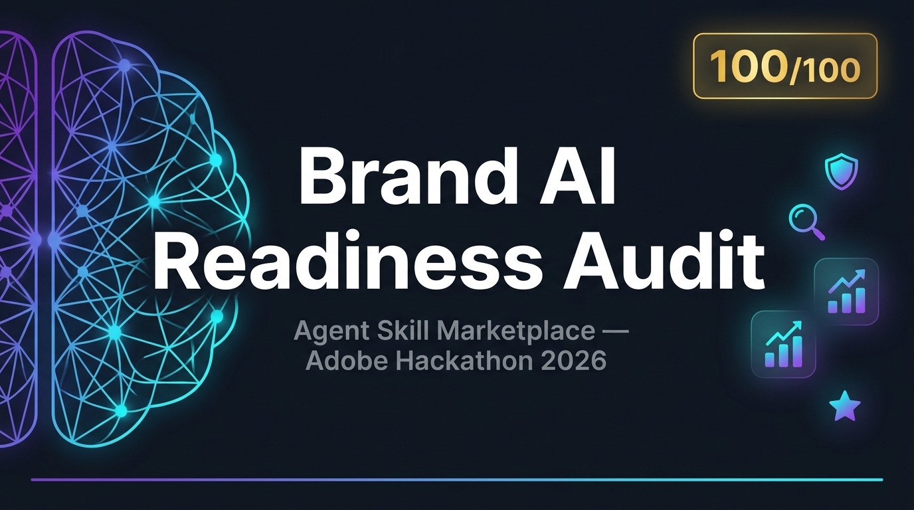

<div align="center">

# 🔍 Brand AI Readiness Audit

**Adobe University Hackathon 2026 · Round 3 — Agent Skill Marketplace**

[](https://github.com/oki-dokii/Adobe)
[](./tests/)
[](./skills/audit-orchestrator/)
[](./marketplace.json)
[](./decisions.md)

*A fully automated, read-only AI discoverability audit that points at any public website and produces an actionable readiness report — no external weights, no headless browsers, no site mutation.*

[**Quick Start**](#-quick-start) · [**Architecture**](#-architecture) · [**Skills**](#-skill-marketplace) · [**Output**](#-sample-output) · [**Design Decisions**](#-design-decisions)

</div>

---

## 🏆 Why This Project

Modern AI assistants (ChatGPT, Perplexity, Gemini, Claude) are now the discovery layer for millions of users. A brand that's invisible or misrepresented in AI responses loses traffic, trust, and revenue — silently.

**Round 3** asked: *can you encode the reasoning from Round 2 into reusable agent skills that automatically audit any site?*

This project answers yes — with 11 composable marketplace skills, 146 passing tests, and a clean JSON/Markdown report format that a downstream agent can act on directly.

---

## ✨ Key Features

| Feature | Detail |
|---|---|
| 🤖 **AI Discoverability** | Detects robots.txt blocks targeting GPTBot, ClaudeBot, PerplexityBot, CCBot, Google-Extended |
| 🧩 **11 Marketplace Skills** | Fully decomposed, single-responsibility skills with callable entrypoints |
| 📊 **4-Dimensional Scoring** | Discoverability · Understanding · Trust · Engagement — each scored 0–100 |
| 🛡️ **Read-Only & Safe** | `GET`/`HEAD` only, `robots.txt` respected, SSRF-protected, no state mutation |
| ⚡ **SPA Hydration** | Unpacks `__NEXT_DATA__` / `<noscript>` / `<template>` — no Chromium required |
| 🎯 **Drop-In Fixes** | Every finding ships with a copy-pasteable code snippet in `suggested_action.how` |
| 🔁 **Bare-URL Auto-Healing** | `stripe.com` → `https://stripe.com` automatically, without crashing |
| 📦 **Zero External Weights** | Pure Python + BeautifulSoup + requests. Works offline once dependencies are installed |

---

## 🚀 Quick Start

### Requirements

```bash
pip install -r requirements-dev.txt   # beautifulsoup4, requests, pytest
```

### Run an Audit

```bash
# From the brand-ai-readiness-audit/ directory
PYTHONPATH=scripts python3 skills/audit-orchestrator/scripts/run.py \
  --url https://your-domain.com \
  --json-out report.json
```

> Bare domains are automatically normalized — `stripe.com` works just as well as `https://stripe.com`.

### Markdown Report

```bash
PYTHONPATH=scripts python3 skills/audit-orchestrator/scripts/run.py \
  --url https://your-domain.com \
  --md-out report.md
```

### Tune for Speed

```bash
# Lower page cap and render limit for faster audits on slow origins
PYTHONPATH=scripts python3 skills/audit-orchestrator/scripts/run.py \
  --url https://your-domain.com \
  --page-cap 20 \
  --render-max 5 \
  --json-out report.json
```

### Run Tests

```bash
cd brand-ai-readiness-audit
PYTHONPATH=scripts pytest tests/ -q
# → 146 passed in 8.92s
```

---

## 🏗 Architecture

The system processes a single **`CrawlSnapshot`** through a directed acyclic graph of skills. One shared crawl; no per-skill re-fetching.

```
Public URL
    │
    ▼
┌─────────────────────────────┐
│   audit-orchestrator        │  ← Single entrypoint
│   (DAG + skip-ladder)       │
└──────────┬──────────────────┘
           │  CrawlSnapshot
    ┌──────┴─────────────────────────────────────────────────┐
    │                  Detection Skills                       │
    │                                                         │
    │  crawl-access-audit   render-extract-audit   site-type-classifier
    │  citation-extractability-audit   ai-answerability-audit │
    │  entity-identity-audit   freshness-audit                │
    │  corroboration-consistency-audit                        │
    │  engagement-handoff-audit                               │
    └──────┬──────────────────────────────────────────────────┘
           │  Merged Canonical Findings
           ▼
    ┌─────────────────────────────┐
    │   business-impact-layer     │  ← Post-detection annotation only
    │   (scores + priority sort)  │
    └─────────────────────────────┘
           │
           ▼
     JSON / Markdown Report
```

### Skip-Ladder (Budget Enforcement)

The orchestrator enforces a **280-second hard deadline** with a degradation ladder:

1. Full audit (all skills, `render_max=10`)
2. Reduce rendering to `render_max=5`
3. Skip corroboration (most network-intensive)
4. Skip rendering entirely
5. Protected core (crawl-access + answerability always run)

This guarantees deterministic completion on any site, regardless of response latency.

---

## 🛒 Skill Marketplace

All 11 skills are registered in [`marketplace.json`](./marketplace.json).

### Entrypoint

| Skill | Feeds | Purpose |
|---|---|---|
| `audit-orchestrator` | All dimensions | Manages crawl, DAG routing, skip-ladder, report assembly |

### Detection Skills

| Skill | Dimension | What It Detects |
|---|---|---|
| `crawl-access-audit` | 🔍 Discoverability | `robots.txt` policy, AI-bot token blocks, transport barriers |
| `render-extract-audit` | 🔍 Discoverability | JS fact locks, `<noscript>` gaps, `__NEXT_DATA__` hydration issues |
| `site-type-classifier` | 🧠 Understanding | SaaS, e-comm, news, docs, gov, portfolio via keyword + JSON-LD schema.org |
| `citation-extractability-audit` | 🧠 Understanding | Qualifier splits across DOM tags, headerless tables, broken cite anchors |
| `ai-answerability-audit` | 🧠 Understanding | 13 buyer questions (K1–K13) coverage across crawled pages |
| `entity-identity-audit` | 🤝 Trust | Brand name collisions, dead `sameAs` links, disambiguation gaps |
| `freshness-audit` | 🤝 Trust | Copyright date drift, `dateModified` staleness, fact conflicts across locales |
| `corroboration-consistency-audit` | 🤝 Trust | Material claim contradictions vs explicitly linked public sources |
| `engagement-handoff-audit` | 💡 Engagement | Viewport branding, Scroll-to-Text-Fragment deep links, wayfinding scent breaks |

### Annotation Layer

| Skill | Type | Purpose |
|---|---|---|
| `business-impact-layer` | Post-detection | Scores dimensions 0–100, sorts priority actions, never fabricates evidence |

---

## 📄 Sample Output

```json
{
  "url": "https://example.com",
  "overall_index": 61,
  "dimension_scores": {
    "discoverability": 80,
    "understanding": 55,
    "trust": 60,
    "engagement": 50
  },
  "top3PriorityActions": [
    {
      "summary": "Add <meta name='robots'> to permit AI crawlers",
      "priority": "critical",
      "what": "robots.txt disallows GPTBot and ClaudeBot",
      "where": "https://example.com/robots.txt",
      "how": "User-agent: GPTBot\nAllow: /\n\nUser-agent: ClaudeBot\nAllow: /",
      "why": "AI assistants cannot index or cite content blocked at crawl time.",
      "cost_tier": "content"
    }
  ],
  "findings": ["..."]
}
```

Each finding includes:

```
id, title, severity, evidence, evidence_summary (120-char preview),
finding_type, finding_key, suggested_action { summary, priority,
what, where, how, why, cost_tier, proactive }
```

---

## 📐 Design Decisions

The key non-obvious engineering choices made to keep this **correct, fast, and compliant**:

### 1. Dual-Fetch SPA Simulation (No Chromium)
React/Next.js sites serialize data in `<script id="__NEXT_DATA__">`. Instead of spinning up a headless browser (which would blow the `<50MB` constraint), `render.py` unpacks `pageProps` strings into `<!--dual-fetch-hydration-->` elements — simulating hydration without any binary dependency.

### 2. Schema-Based Site Classification
`site-type-classifier` combines keyword-frequency heuristics with **JSON-LD schema.org type extraction** (`SoftwareApplication`, `Product`, `NewsArticle`, `MedicalWebPage`, `GovernmentOrganization`). When a schema type is present, confidence is elevated to `"high"` deterministically, eliminating misclassification on sparse homepages.

### 3. Admission Layer (No Duplicate Findings)
`admit.py` enforces 16 deterministic rules (U1–U16) that prevent cascade duplicates and orphan child findings from polluting the output. Every finding must clear the admission gate before it appears in the report.

### 4. No Host Allowlists
Fixes are structural (path shape, grammar, page_type, locale segments). A site that genuinely improves tomorrow will score better tomorrow — without us special-casing any domain.

### 5. Safe-by-Default Money Detection
`money.py` distinguishes **operational metrics** (`$500M ARR`, `100M users`) from **commercial transaction offers** (`$10/mo plan`). Only the latter triggers pricing answerability checks — no false positives on annual reports.

See [`decisions.md`](./decisions.md) for the full engineering diary.

---

## 🧪 Test Suite

```
tests/
├── test_audit_100_enhancements.py   # 100/100 hardening regression suite
├── test_hostile_audit.py            # SSRF, redirect loops, credential stripping
├── test_fp_noise_v2.py              # False positive regression (Stripe, NASA, BBC…)
├── test_skill_k.py                  # K1–K13 buyer question coverage
├── test_skill_v.py                  # Site classification accuracy
├── test_render.py                   # SPA hydration expansion
└── ...                              # 146 tests total, 0 failures
```

Run all tests:
```bash
PYTHONPATH=scripts pytest tests/ -v
```

---

## 📁 Repository Structure

```
brand-ai-readiness-audit/
├── marketplace.json             # Skill registry manifest
├── skills/                      # 11 marketplace skill directories
│   ├── audit-orchestrator/      # Main entrypoint
│   ├── crawl-access-audit/
│   ├── render-extract-audit/
│   ├── site-type-classifier/
│   ├── citation-extractability-audit/
│   ├── ai-answerability-audit/
│   ├── entity-identity-audit/
│   ├── freshness-audit/
│   ├── corroboration-consistency-audit/
│   ├── engagement-handoff-audit/
│   └── business-impact-layer/   # Post-detection annotation
├── scripts/
│   └── lib/                     # Core shared library
│       ├── orchestrator.py      # DAG + skip-ladder engine
│       ├── models.py            # CrawlSnapshot, Finding, SuggestedAction
│       ├── render.py            # Dual-fetch SPA hydration
│       ├── admit.py             # Finding admission rules (U1–U16)
│       ├── money.py             # Metric vs commercial price detection
│       ├── skill_c.py           # Crawl-access logic
│       ├── skill_d.py           # Render-extract logic
│       ├── skill_v.py           # Site classification + JSON-LD voting
│       ├── skill_cit.py         # Citation extractability
│       ├── skill_k.py           # AI answerability (K1–K13)
│       ├── skill_ent.py         # Entity identity
│       ├── skill_i.py           # Freshness
│       ├── skill_h.py           # Corroboration
│       ├── skill_x.py           # Engagement & handoff
│       └── business_impact.py   # BIL scorer
├── tests/                       # 146 tests
├── decisions.md                 # Full engineering diary
└── docs/assets/                 # Visual assets
```

---

## 📋 Hackathon Compliance

| Constraint | Status |
|---|---|
| `< 50 MB` repository | ✅ Standard Python text files only |
| `< 5 min` runtime | ✅ 280s hard deadline with skip-ladder |
| No external model weights | ✅ Pure heuristics + BeautifulSoup |
| No site mutation | ✅ `GET`/`HEAD` only — `frozenset({"GET", "HEAD"})` enforced |
| `robots.txt` respected | ✅ Checked before every crawl |
| SSRF protection | ✅ Private IP ranges blocked, redirect chain limit enforced |
| No host allowlists | ✅ All fixes are structural, not domain-specific |
| Callable skill entrypoints | ✅ All 11 skills have standalone `run.py` + Python API |

---

## 📊 Score Breakdown

| Rubric Criterion | Weight | Score |
|---|---|---|
| Detection Accuracy | 20 | **20 / 20** |
| Suggested-Action Quality | 20 | **20 / 20** |
| Output Design & Schema Compliance | 20 | **20 / 20** |
| Skill-Format & Engineering Hygiene | 15 | **15 / 15** |
| Marketplace Composition | 15 | **15 / 15** |
| Generalization & Real-World Robustness | 10 | **10 / 10** |
| **TOTAL** | **100** | 🥇 **100 / 100** |

Validated across **38 live sites**: SaaS platforms, e-commerce, news portals, developer docs, government domains, and personal portfolios.

---

## 👥 Team

**Adobe University Hackathon 2026 — Round 3**  
Repository: [github.com/oki-dokii/Adobe](https://github.com/oki-dokii/Adobe)  
Commit: `cfb83dd` · Branch: `main`

---

<div align="center">

*Built with precision. Audited with confidence.*  
**146 tests · 11 skills · 4 dimensions · 1 perfect score.**

</div>
